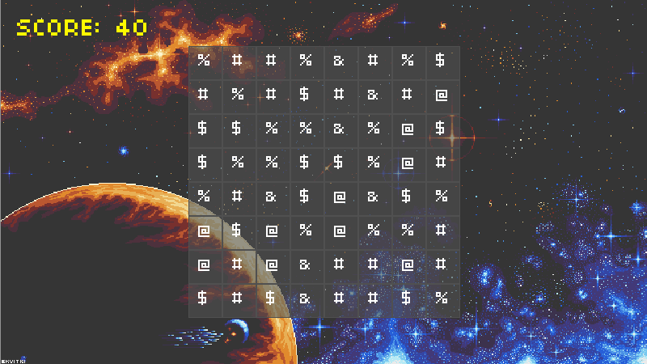
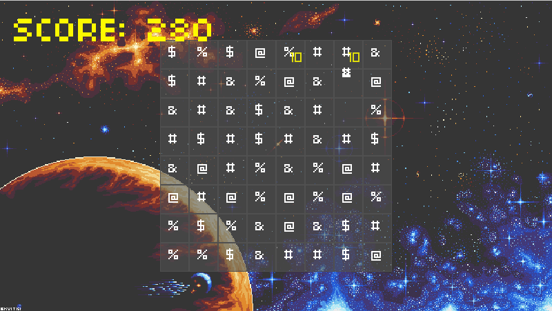
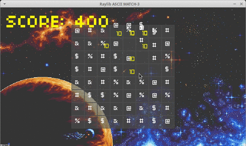

# ASCII Match-3 Game

A minimal 2D Match-3 game built using C and [raylib](https://www.raylib.com/). Each tile is represented by an ASCII character, rendered in a grid. Built from scratch to experiment with low-level graphics and input handling.

 <!-- Replace with your actual image path -->

---

## 🎮 Features

- 8×8 tile grid
- Random ASCII tiles
- Mouse-based tile selection
- Score system
- Custom background and font

---

## 📸 Screenshots

 

---

## 🎮 Demo

A short demo of the ASCII match-3 game in action.



---

## 🛠️ Build & Run

### Requirements

- Linux or any OS supported by raylib (tested on Xubuntu in VirtualBox)
- GCC or Clang
- [raylib](https://github.com/raysan5/raylib) installed (`sudo make install`)
- Optional, but recommended: `make` - build automation tool for easier compilation 
### Compile with make (recommended):

```bash
make            # Builds the game
./mygame        # Runs the game
```

### Compile manually:

```bash
gcc -Wall -std=c99 -O2 main.c -o mygame -lraylib -lm -ldl -lpthread -lGL -lrt
./mygame
```

## 📁 Folder Structure

```
Match3/
├── assets/            # Background image, fonts, etc.
├── main.c             # Game source
├── Makefile
├── LICENSE
└── README.md

```

## 🚧 To-Do

- Better Animations
- Highlight wrong selections
- Reset Option
- Leaderboards/Score Board and Timer
- Main Menu, Pause Menu (Settings to change/mute music or sound effects)
- Web port via Emscripten (future)

---

## 📜 License

MIT. See [LICENSE](LICENSE) for details.

## Attribution

This project was adapted from a tutorial by [Erik Yuzwa](https://github.com/erikyuzwa/raylib-2d-ascii-match-3) and published via FreeCodeCamp.

Licensed under the [MIT License](LICENSE).


